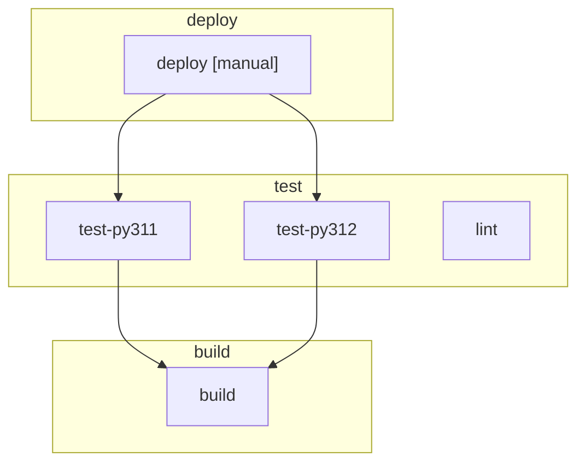
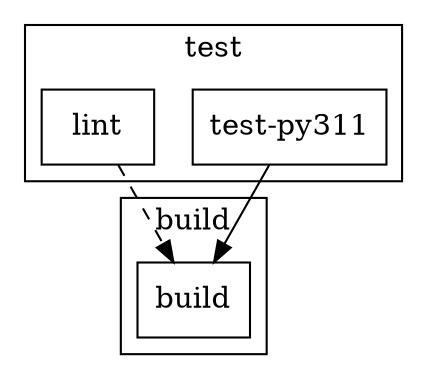

# CLI Reference

The `wetwire-gitlab` command provides tools for generating and validating GitLab CI/CD configuration.

## Quick Reference

| Command | Description |
|---------|-------------|
| `wetwire-gitlab build` | Generate .gitlab-ci.yml from Python definitions |
| `wetwire-gitlab validate` | Validate pipeline using GitLab CI lint API |
| `wetwire-gitlab lint` | Check code for wetwire-gitlab issues |
| `wetwire-gitlab list` | List discovered jobs and pipelines |
| `wetwire-gitlab import` | Import .gitlab-ci.yml to Python code |
| `wetwire-gitlab init` | Initialize a new project |
| `wetwire-gitlab graph` | Generate pipeline dependency graph |
| `wetwire-gitlab design` | AI-assisted pipeline design |
| `wetwire-gitlab test` | Automated persona-based testing |

```bash
wetwire-gitlab --version  # Show version
wetwire-gitlab --help     # Show help
```

> **Note**: When developing with uv, prefix commands with `uv run`:
> ```bash
> uv run wetwire-gitlab build ./ci
> ```

---

## build

Generate GitLab CI/CD configuration YAML from Python definitions.

```bash
# Build from package path (simplest)
wetwire-gitlab build ./ci > .gitlab-ci.yml

# Build using specific directory
wetwire-gitlab build -d src/ci

# Generate JSON format
wetwire-gitlab build --format json

# Print to stdout
wetwire-gitlab build --stdout

# Write to specific file
wetwire-gitlab build -o custom-pipeline.yml
```

### Options

| Option | Description |
|--------|-------------|
| `PATH` | Path to package directory (positional argument) |
| `--directory, -d` | Source directory containing pipeline code (default: `.`) |
| `--output, -o` | Output file path (default: `.gitlab-ci.yml`) |
| `--format, -f` | Output format: `yaml` (default) or `json` |
| `--stdout` | Print to stdout instead of file |

### How It Works

1. Discovers Python modules in the specified directory
2. Imports modules and finds Job and Pipeline declarations
3. Collects all discovered jobs and pipelines
4. Orders jobs topologically by dependencies (needs/extends)
5. Generates GitLab CI YAML or JSON

### Output Modes

**YAML (default):**
```yaml
stages:
  - build
  - test
  - deploy

build:
  stage: build
  script:
    - make build
  artifacts:
    paths:
      - build/

test:
  stage: test
  script:
    - make test
  needs:
    - build
```

**JSON:**
```json
{
  "stages": ["build", "test", "deploy"],
  "build": {
    "stage": "build",
    "script": ["make build"],
    "artifacts": {"paths": ["build/"]}
  }
}
```

---

## validate

Validate pipeline configuration using GitLab CLI (glab).

```bash
# Validate default .gitlab-ci.yml
wetwire-gitlab validate

# Validate specific file
wetwire-gitlab validate -f custom.yml

# Include expanded job configurations
wetwire-gitlab validate --include-jobs

# Dry run (don't report to GitLab)
wetwire-gitlab validate --dry-run
```

### Options

| Option | Description |
|--------|-------------|
| `--file, -f` | YAML file to validate (default: `.gitlab-ci.yml`) |
| `--include-jobs` | Validate expanded job configurations |
| `--dry-run` | Only validate, don't report to GitLab |

### What It Checks

1. **YAML Syntax**: Valid YAML structure
2. **GitLab Schema**: Validates against GitLab CI schema
3. **Job Configuration**: With `--include-jobs`, validates job scripts and artifacts
4. **References**: Checks that job dependencies exist

### Output Examples

**Validation passed:**
```
Pipeline is valid
```

**Validation failed:**
```
Validation failed:
  jobs:build: unknown keys: scriptt
  jobs:test: needs references unknown job 'missing'
```

### Requirements

Requires `glab` CLI to be installed and authenticated:

```bash
# Install glab
brew install glab  # macOS
# or
sudo apt install glab  # Debian/Ubuntu

# Authenticate
glab auth login
```

---

## lint

Check pipeline code for common issues and style violations.

```bash
# Lint current directory
wetwire-gitlab lint

# Lint specific path
wetwire-gitlab lint src/ci

# Output as JSON
wetwire-gitlab lint --format json

# Run specific rules only
wetwire-gitlab lint -r WGL001 -r WGL002

# Auto-fix issues
wetwire-gitlab lint --fix

# Verbose output
wetwire-gitlab lint --verbose
```

### Options

| Option | Description |
|--------|-------------|
| `PATH` | File or directory to lint (default: `.`) |
| `--format, -f` | Output format: `text` (default) or `json` |
| `--rule, -r` | Only run specific rules (can be repeated) |
| `--fix` | Automatically fix issues where possible |
| `--verbose, -v` | Verbose output |

### Lint Rules

| Rule ID | Description | Auto-Fix |
|---------|-------------|:--------:|
| WGL001 | Use typed component wrappers | - |
| WGL002 | Use Rule dataclass instead of raw dict | - |
| WGL003 | Use predefined variables from intrinsics | - |
| WGL004 | Use Cache dataclass instead of raw dict | - |
| WGL005 | Use Artifacts dataclass instead of raw dict | - |
| WGL006 | Use typed stage constants | - |
| WGL007 | Duplicate job names | - |
| WGL008 | File contains too many jobs (>15) | - |
| WGL009 | Use predefined Rules constants | - |
| WGL010 | Use typed When constants | Yes |
| WGL011 | Missing stage in Job | - |
| WGL012 | Use CachePolicy constants | - |
| WGL013 | Use ArtifactsWhen constants | - |
| WGL014 | Jobs should have script, trigger, or extends | - |
| WGL015 | Jobs should have explicit name | - |
| WGL016 | Use Image dataclass | - |
| WGL017 | Empty rules list means job never runs | - |
| WGL018 | Jobs with needs should specify stage | - |
| WGL019 | Manual jobs should consider allow_failure | - |

### Example: Auto-fixing Code

**Before:**
```python
job = Job(
    name="deploy",
    when="manual",  # String literal
)
```

**After `wetwire-gitlab lint --fix`:**
```python
from wetwire_gitlab.intrinsics import When

job = Job(
    name="deploy",
    when=When.MANUAL,  # Typed constant
)
```

### Output Examples

**Text format:**
```
src/ci/jobs.py:15:1 WGL010 Use When.MANUAL instead of 'manual'
src/ci/jobs.py:23:1 WGL011 Job 'deploy' should have explicit stage

Found 2 issues in 1 file
```

**JSON format:**
```json
{
  "issues": [
    {
      "code": "WGL010",
      "message": "Use When.MANUAL instead of 'manual'",
      "file_path": "src/ci/jobs.py",
      "line_number": 15
    }
  ],
  "files_checked": 3
}
```

---

## list

Display discovered jobs and pipelines.

```bash
# List jobs in current directory
wetwire-gitlab list

# List from specific directory
wetwire-gitlab list -d src/ci

# Output as JSON
wetwire-gitlab list --format json
```

### Options

| Option | Description |
|--------|-------------|
| `--directory, -d` | Source directory (default: `.`) |
| `--format, -f` | Output format: `table` (default) or `json` |

### Output Example

**Table format:**
```
Jobs (5):

  build          stage=build      needs=[]
  test-py311     stage=test       needs=[build]
  test-py312     stage=test       needs=[build]
  lint           stage=test       needs=[]
  deploy         stage=deploy     needs=[test-py311, test-py312]

Pipelines (1):

  pipeline       stages=[build, test, deploy]
```

**JSON format:**
```json
{
  "jobs": [
    {"name": "build", "stage": "build", "needs": []},
    {"name": "test-py311", "stage": "test", "needs": ["build"]}
  ],
  "pipelines": [
    {"name": "pipeline", "stages": ["build", "test", "deploy"]}
  ]
}
```

---

## import

Convert existing .gitlab-ci.yml to Python code.

```bash
# Import to ci/ directory
wetwire-gitlab import .gitlab-ci.yml

# Import to specific directory
wetwire-gitlab import -o src/pipeline .gitlab-ci.yml

# Generate single file instead of package
wetwire-gitlab import --single-file .gitlab-ci.yml

# Skip scaffold files (README, CLAUDE.md)
wetwire-gitlab import --no-scaffold .gitlab-ci.yml
```

### Options

| Option | Description |
|--------|-------------|
| `FILE` | Path to .gitlab-ci.yml (required) |
| `--output, -o` | Output directory (default: `ci/`) |
| `--single-file` | Generate single file instead of directory |
| `--no-scaffold` | Don't create __init__.py and scaffold files |

### How It Works

1. Parses the YAML file into intermediate representation
2. Converts jobs to `Job` dataclass declarations
3. Converts rules to `Rule` dataclass declarations
4. Generates Python code with proper imports
5. Creates package structure with `__init__.py`

### Generated Structure

```
ci/
├── __init__.py      # Package exports
├── jobs.py          # Job definitions
├── pipeline.py      # Pipeline definition
├── README.md        # Build instructions
└── CLAUDE.md        # AI assistant context
```

### Example Conversion

**Input (.gitlab-ci.yml):**
```yaml
build:
  stage: build
  script:
    - make build
  artifacts:
    paths:
      - build/
```

**Output (jobs.py):**
```python
from wetwire_gitlab.pipeline import Job, Artifacts

build = Job(
    name="build",
    stage="build",
    script=["make build"],
    artifacts=Artifacts(paths=["build/"]),
)
```

---

## graph

Visualize pipeline dependency graph.

```bash
# Generate Mermaid diagram (default)
wetwire-gitlab graph

# Generate DOT format (Graphviz)
wetwire-gitlab graph --format dot

# Save to file
wetwire-gitlab graph -o pipeline.mmd

# Include pipeline variables as nodes
wetwire-gitlab graph --params

# Group jobs by stage
wetwire-gitlab graph --cluster

# Combine options
wetwire-gitlab graph --cluster --params --format dot -o pipeline.dot
```

### Options

| Option | Description |
|--------|-------------|
| `--directory, -d` | Source directory (default: `.`) |
| `--format, -f` | Output format: `mermaid` (default) or `dot` |
| `--output, -o` | Output file (stdout if not specified) |
| `--params, -p` | Include pipeline variables as nodes |
| `--cluster, -c` | Group jobs by stage in subgraphs |

### Node Annotations

Jobs with special conditions are annotated:
- `[manual]` - Jobs with `when: manual`
- `[always]` - Jobs with `when: always`
- `[on_failure]` - Jobs with `when: on_failure`

### Edge Types

- **Solid edges**: `needs` dependencies
- **Dashed edges**: `extends` relationships (DOT only)

### Example Output (Mermaid)



### Example Output (DOT)



### Rendering

**Mermaid** (GitHub, GitLab, documentation):
- Embed directly in Markdown files
- Use Mermaid Live Editor: https://mermaid.live

**DOT** (Graphviz):
```bash
# Install graphviz
brew install graphviz  # macOS

# Render to PNG
wetwire-gitlab graph --format dot | dot -Tpng -o pipeline.png

# Render to SVG
wetwire-gitlab graph --format dot | dot -Tsvg -o pipeline.svg
```

---

## init

Initialize a new wetwire-gitlab project.

```bash
# Initialize in current directory
wetwire-gitlab init

# Initialize in new directory
wetwire-gitlab init my-pipeline

# With custom project name
wetwire-gitlab init -n my_ci my-pipeline

# Skip scaffold files
wetwire-gitlab init --no-scaffold my-pipeline

# Force overwrite existing
wetwire-gitlab init --force my-pipeline

# Verbose output
wetwire-gitlab init --verbose my-pipeline
```

### Options

| Option | Description |
|--------|-------------|
| `DIRECTORY` | Output directory (default: current directory) |
| `--name, -n` | Package name (default: directory name) |
| `--force` | Overwrite existing files |
| `--no-scaffold` | Skip README.md, CLAUDE.md, .gitignore |
| `--verbose, -v` | List created files |
| `--description` | Package description |

### Created Structure

```
my-pipeline/
├── __init__.py      # Package with exports
├── jobs.py          # Example job definitions
├── pipeline.py      # Pipeline definition
├── README.md        # Build instructions
├── CLAUDE.md        # AI assistant context
└── .gitignore       # Python patterns
```

### Generated Files

**jobs.py:**
```python
from wetwire_gitlab.pipeline import Job

build = Job(
    name="build",
    stage="build",
    script=["echo 'Building...'"],
)

test = Job(
    name="test",
    stage="test",
    script=["echo 'Testing...'"],
    needs=["build"],
)
```

**pipeline.py:**
```python
from wetwire_gitlab.pipeline import Pipeline

pipeline = Pipeline(
    stages=["build", "test", "deploy"],
)
```

Created packages are immediately buildable:
```bash
wetwire-gitlab build my-pipeline
```

---

## design

AI-assisted pipeline design. Starts an interactive session where you describe your CI/CD needs and the AI generates wetwire-gitlab Python code.

**Providers:**
- `anthropic` (default) - Requires `wetwire-core` package and `ANTHROPIC_API_KEY`
- `kiro` - Requires Kiro CLI. See below for setup.

```bash
# Start interactive design session
wetwire-gitlab design

# Start with a prompt
wetwire-gitlab design "Create a Python CI pipeline with testing and deployment"

# Specify output directory
wetwire-gitlab design -o ./ci "Create a Docker build pipeline"

# Use streaming output
wetwire-gitlab design --stream

# Use Kiro CLI instead of Anthropic API
wetwire-gitlab design --provider kiro
```

### Options

| Option | Description |
|--------|-------------|
| `prompt` | Initial prompt describing what to build (optional) |
| `-o, --output` | Output directory (default: current directory) |
| `-p, --provider` | AI provider: `anthropic` (default) or `kiro` |
| `--stream` | Stream AI responses (anthropic only) |
| `--max-lint-cycles` | Maximum lint/fix cycles (default: 3) |

### How It Works

1. **Conversation**: AI asks clarifying questions about your requirements
2. **Code Generation**: Generates Python code using wetwire-gitlab patterns
3. **Lint Cycle**: Runs `wetwire-gitlab lint --fix` to fix issues
4. **Build**: Runs `wetwire-gitlab build` to generate .gitlab-ci.yml
5. **Iteration**: Ask for changes or additions

Press `Ctrl+C` to stop the session at any time.

### Example Session

```
$ wetwire-gitlab design "Create a Python CI pipeline"

Runner: I'll help you create a Python CI pipeline. A few questions:

1. Which Python versions do you want to test? (e.g., 3.11, 3.12, 3.13)
2. What testing framework do you use? (pytest, unittest, etc.)
3. Do you want to include linting? (ruff, flake8, etc.)

You: Python 3.11-3.13, pytest, and ruff for linting

Runner: I'll create the pipeline with those requirements.
[init_package] Created package 'ci' at ./ci
[write_file] Wrote jobs.py (850 bytes)
[write_file] Wrote pipeline.py (120 bytes)
[run_lint] PASS: Lint passed with no issues
[run_build] OK: Build successful, generated .gitlab-ci.yml

What's next? (type done to exit):
```

---

## test

Run automated scenario testing to evaluate AI code generation quality.

**Providers:**
- `anthropic` (default) - Uses persona-based testing with `wetwire-core`
- `kiro` - Uses Kiro CLI for scenario execution

```bash
# Run with default persona (intermediate)
wetwire-gitlab test "Create a multi-stage Docker pipeline"

# Use a specific persona
wetwire-gitlab test --persona beginner "Create a simple test job"

# Specify output directory
wetwire-gitlab test -o ./output "Create encrypted deployment"

# Use Kiro CLI instead of Anthropic
wetwire-gitlab test --provider kiro "Create a Python CI pipeline"

# Kiro with custom timeout (default: 300s)
wetwire-gitlab test --provider kiro --timeout 600 "Create complex pipeline"
```

### Personas

Personas simulate different user skill levels and communication styles:

| Persona | Description |
|---------|-------------|
| `beginner` | New to GitLab CI, asks many clarifying questions |
| `intermediate` | Familiar with CI/CD basics (default) |
| `expert` | Deep GitLab knowledge, asks advanced questions |
| `terse` | Gives minimal responses |
| `verbose` | Provides detailed context |

### Options

| Option | Description |
|--------|-------------|
| `prompt` | Pipeline description to test (required) |
| `--persona` | Persona for anthropic provider (default: `intermediate`) |
| `-o, --output` | Output directory (default: current directory) |
| `-p, --provider` | AI provider: `anthropic` (default) or `kiro` |
| `-t, --timeout` | Timeout in seconds for kiro provider (default: 300) |

### Scoring (Anthropic Provider)

Tests are scored on 5 dimensions:

| Dimension | Description |
|-----------|-------------|
| Completeness | Does the pipeline meet requirements? |
| Lint Quality | Are there lint issues? |
| Code Quality | Is the code well-structured? |
| Output Validity | Does it generate valid YAML? |
| Question Efficiency | How many clarifying questions needed? |

### Output

```
Running test with persona: beginner
Prompt: Create a Python CI pipeline

--- Conversation Summary ---
[DEVELOPER] Create a Python CI pipeline
[RUNNER] I'll create a pipeline. Which Python versions?
[DEVELOPER] 3.11 and 3.12
[TOOL] [lint PASS] Lint passed with no issues
[TOOL] [build OK] Build successful

--- Scores ---
Completeness: 5/5
Lint Quality: 5/5
Code Quality: 4/5
Output Validity: 5/5
Question Efficiency: 4/5
Total: 23/25

Package created: ./ci
```

---

## Typical Workflow

### Development

```bash
# Initialize a new project
wetwire-gitlab init ci

# List discovered jobs
wetwire-gitlab list -d ci

# Lint code for issues
wetwire-gitlab lint ci

# Build pipeline YAML
wetwire-gitlab build ci

# Visualize dependencies
wetwire-gitlab graph ci --cluster
```

### CI/CD Integration

```yaml
# .gitlab-ci.yml (for wetwire-gitlab itself)
generate-pipeline:
  stage: build
  script:
    - pip install wetwire-gitlab
    - wetwire-gitlab lint ci/
    - wetwire-gitlab build ci/ -o generated.yml
  artifacts:
    paths:
      - generated.yml
```

### Migration from YAML

```bash
# 1. Import existing pipeline
wetwire-gitlab import .gitlab-ci.yml -o ci/

# 2. Review and fix lint issues
wetwire-gitlab lint ci/ --fix

# 3. Verify output matches original
wetwire-gitlab build ci/ -o new.yml
diff .gitlab-ci.yml new.yml

# 4. Replace original
mv new.yml .gitlab-ci.yml
```

### Team Workflow

```bash
# Developer creates feature branch
git checkout -b feature/add-security-scanning

# Add security jobs using typed API
# Edit ci/jobs.py to add SAST, Secret Detection

# Lint and build
wetwire-gitlab lint ci/
wetwire-gitlab build ci/

# Validate with GitLab
wetwire-gitlab validate

# Commit and push
git add ci/ .gitlab-ci.yml
git commit -m "Add security scanning jobs"
git push
```

---

## Dependencies

### wetwire-core (Anthropic provider)

The `design` and `test` commands with `--provider anthropic` (default) require [wetwire-core](https://github.com/lex00/wetwire-core-python):

```bash
pip install wetwire-core
```

Or add to your project:
```bash
uv add wetwire-core
```

### Anthropic API

The `--provider anthropic` option requires an Anthropic API key:

```bash
export ANTHROPIC_API_KEY="sk-ant-..."
```

### Kiro CLI (Kiro provider)

The `--provider kiro` option requires:

1. **Kiro CLI** installed and in PATH
2. **wetwire-gitlab[kiro]** extras for MCP support

```bash
# Install wetwire-gitlab with Kiro support
uv add "wetwire-gitlab[kiro]"

# Verify Kiro CLI is installed
kiro-cli --version
```

### glab CLI (validate command)

The `validate` command requires GitLab CLI:

```bash
# Install glab
brew install glab      # macOS
sudo apt install glab  # Debian/Ubuntu

# Authenticate
glab auth login
```

---

## Exit Codes

| Code | Meaning |
|------|---------|
| 0 | Success |
| 1 | Error or issues found |
| 2 | Invalid arguments |

---

## Troubleshooting

### Common Errors

**"No module named 'wetwire_core'"**
```
Install wetwire-core for design/test commands:
pip install wetwire-core
```

**"glab: command not found"**
```
Install GitLab CLI for validate command:
brew install glab  # macOS
```

**"ANTHROPIC_API_KEY not set"**
```
Set API key for design/test with anthropic provider:
export ANTHROPIC_API_KEY="sk-ant-..."
```

**"No jobs found in directory"**
```
Ensure your Python files contain Job declarations:
- Jobs must be module-level variables
- Jobs must be instances of Job class
- Files must be valid Python (no syntax errors)
```

**"Circular dependency detected"**
```
Check your job needs/extends for cycles:
- Job A needs Job B
- Job B needs Job A (creates cycle)
Use wetwire-gitlab graph to visualize dependencies.
```

### Debugging

```bash
# Verbose output
wetwire-gitlab build --verbose

# Check discovered jobs
wetwire-gitlab list

# Validate YAML syntax
wetwire-gitlab validate --dry-run

# Visualize dependencies
wetwire-gitlab graph --cluster
```

---

## See Also

- [Quick Start](QUICK_START.md) - Create your first project
- [Examples](EXAMPLES.md) - Example projects and patterns
- [Lint Rules](LINT_RULES.md) - Detailed lint rule documentation
- [Internals](INTERNALS.md) - How discovery and serialization works
- [Adoption Guide](ADOPTION.md) - Migration strategies
